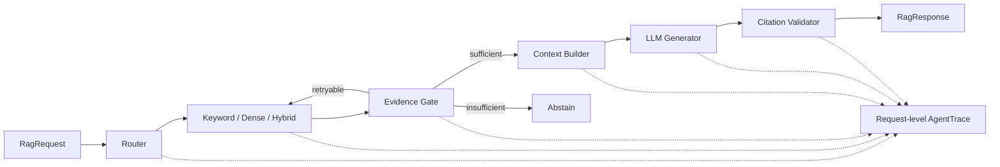
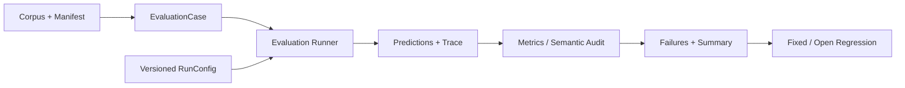

# EvalRAG

EvalRAG 是一个面向求职知识问答的、可观测、可评测、可回归的 RAG Agent Harness。
系统融合岗位 JD、技术面经、项目文档和个人经历等中文多源知识，重点解决三类问题：
一次回答为何产生、失败发生在哪个阶段、系统修改后是否真的改善。

## 核心结果

正式数据集 `evalrag_v0.2` 包含 100 份五类中文文档、310 个自然 Chunk 和 120 条
审核 Query（80 dev / 40 frozen test）。下表是同一 frozen test、相同 Router 与 top-k
下的检索结果：

| Retriever | Recall@3 | Recall@5 | MRR | Retrieval P95 |
|---|---:|---:|---:|---:|
| Keyword | 55.56% | 67.22% | 60.83% | 99.55 ms |
| Dense | 56.67% | 74.44% | 59.28% | 494.05 ms |
| RRF Hybrid | **68.33%** | **74.44%** | **66.78%** | 802.50 ms |

Hybrid 提高了候选覆盖和首个相关结果排名，但 CPU P95 明显增加；Reranker 在 dev
消融中同时降低 Recall/MRR 并增加延迟，因此最终关闭。完整数字和失败 Case 见
[Frozen Retrieval Comparison](reports/comparisons/p0-d5-v02-frozen-test-20260804/report.md)。

真实 LLM frozen run 共 40 条 Query，Citation Validity 与 Abstention Accuracy 均为
100%，总延迟 P95 为 4136.71 ms，25 次模型调用共 39,147 tokens，按运行时价格
快照估算 $0.006317。Claim-Level Grounding 对 23 条 answered case 中的 20 条得到
可判断结论，另有 3 条 unknown，因此不宣称“零幻觉”或完整 E2E 可用。证据分别见
[Live LLM Report](reports/final/p0-d5-live-llm-v0.2/report.md) 和
[Semantic/Grounding Audit](reports/final/p0-d6-semantic-grounding-v0.2/report.md)。

## 两条主链





更完整的数据结构和失败分支见 [架构图](docs/overview/architecture_diagram.md) 与
[项目地图](docs/overview/project_map_zh.md)。

## 可复现验证

Python 3.10+，推荐在虚拟环境中运行：

```bash
python -m pip install -r requirements.txt
PYTHONPATH=src python -m unittest discover -s tests -p 'test_*.py'
```

当前全量结果为 142 tests passed（2026-08-07，包含本地 PostgreSQL/Redis 集成测试）；测试通过证明代码行为稳定，不代表
回答准确率。

### HTTP 与异步 Evaluation

P1 服务层复用相同 `RagRequest`、`RagResponse`、Citation 和 AgentTrace：

```text
HTTP Query -> FastAPI -> RagPipeline -> PostgreSQL request/trace
Evaluation Job -> PostgreSQL queued -> Redis -> Worker -> report + final status
```

在 Docker 可用的机器上启动完整服务：

```bash
docker compose up --build
curl http://localhost:8000/health
```

提交 BM25 Query：

```bash
curl -X POST http://localhost:8000/v1/query \
  -H 'Content-Type: application/json' \
  -d '{"query":"请分析大模型应用研发实习生的岗位要求","retriever":"bm25"}'
```

批量 Evaluation 通过 `POST /v1/evaluation-jobs` 创建，接口只返回 job id；独立
Worker 执行后可通过 `GET /v1/evaluation-jobs/{job_id}` 查询状态。Compose 端到端
流程由 [P1 Service Integration](.github/workflows/p1-service.yml) 自动验证。

导出不访问网络的三个固定 Demo：

```bash
python scripts/export_fixed_demos.py
```

- [单来源回答](examples/fixed_demos/single_source.json)
- [多来源回答](examples/fixed_demos/multi_source.json)
- [证据不足拒答](examples/fixed_demos/abstention.json)

三个文件来自同一次真实 frozen run，均包含 `answer`、带 source path 的 citations、
精简 Trace 和完整 RunConfig。脚本只重放已保存工件，不重新调用 LLM。

需要运行真实模型 smoke test 时，在本地 `.env` 或 shell 中设置
`DEEPSEEK_API_KEY`；密钥不会写入代码、Trace 或报告：

```bash
export DEEPSEEK_API_KEY='your-key'
PYTHONPATH=src python scripts/run_rag_smoke.py
```

## 代码导航

| 模块 | 入口 | 作用 |
|---|---|---|
| Ingestion | `src/intern_rag/ingestion/chunking.py` | 统一 Document/Chunk 与 metadata |
| Router | `src/intern_rag/routing/factory.py` | Rule/Semantic/Hybrid 路由切换 |
| Retrieval | `src/intern_rag/retrieval/factory.py` | Keyword/BM25/Dense/RRF/Rerank 统一接口 |
| Agent | `src/intern_rag/agent/pipeline.py` | 门控、有限重试、生成与引用校验 |
| Trace | `src/intern_rag/tracing/trace.py` | 一次请求一条可回放 Trace |
| Evaluation | `src/intern_rag/evaluation/runner.py` | 运行预测并保存标准工件 |
| Semantic Audit | `src/intern_rag/evaluation/semantic_audit.py` | 要点覆盖与逐 claim Grounding |
| Regression | `src/intern_rag/evaluation/regression.py` | fixed/open 失败案例自动化检查 |
| Serving | `src/intern_rag/serving/api.py` | Query、Trace、异步 Evaluation HTTP 契约 |
| Persistence | `src/intern_rag/persistence/postgres.py` | PostgreSQL 请求、Trace、Job 与 Run 元数据 |
| Worker | `src/intern_rag/worker/evaluation_worker.py` | Redis Queue 与独立 Evaluation Worker |

## 实验与边界

- [文档导航](docs/README.md)：项目概览、评测协议、架构与模块说明。
- [最终实验报告](docs/evaluation/final_experiment_report.md)：数据、检索、Router、可靠性、成本和失败闭环。
- `evalrag_v0.2` 是项目自建、人工审核的半真实 benchmark，不代表线上业务分布。
- Recall@k/MRR 只衡量检索；Citation Validity 只验证引用 ID；Semantic Coverage 与
  Claim-Level Grounding 使用模型评分，均不等于人工答案准确率。

项目使用原生 Python 实现核心 Harness；Sentence Transformers/scikit-learn 用于向量
编码，OpenAI-compatible client 作为可替换 LLM adapter。P1 使用 FastAPI、PostgreSQL、
Redis Worker 和 Docker Compose 提供可复现服务链；不包含前端、Kubernetes 或微服务拆分。
