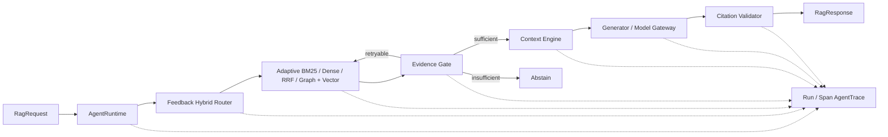
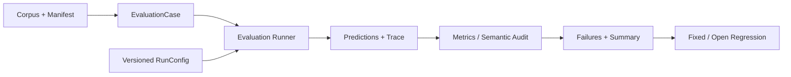

# EvalRAG

EvalRAG 是一个面向求职知识问答的、可观测、可评测、可回归的 RAG Agent Harness。
系统融合岗位 JD、技术面经、项目文档和个人经历等中文多源知识，重点解决三类问题：
一次回答为何产生、失败发生在哪个阶段、系统修改后是否真的改善。

## 快速理解

- [项目地图：主链、模块设计、算法和真实效果](docs/overview/project_map_zh.md)
- [三条运行链路：在线回答、离线评测、异步 Job](docs/overview/system_flows_explained_zh.md)
- [最终实验报告：配置、指标、失败和证据路径](docs/evaluation/final_experiment_report.md)

## 核心结果

P1-D4 将知识库升级为 `evalrag_v0.3`：从固定 revision 的公开数据集/开源仓库和
脱敏自有资料导入 669 份文档，经 exact hash 与 SimHash 去重后保留 658 份、生成
4208 个自然 Chunk。五类 source 均有覆盖，每份材料保留 URL/采集方式/时间/许可与
审核状态；质量报告记录 6 个完全重复、5 个近重复和 3.06% 模板行占比。v0.3
benchmark 共 240 条（160 dev / 80 frozen test），覆盖单源、跨源、语义改写、
hard negative、不可回答、时效冲突及 2/3 跳关系问题；标签为 corpus-grounded
AI-assisted，未冒充人工审核。

在 160 条 v0.3 dev 上，Graph + Vector 取得当前最佳检索结果：Recall@3 42.50%、
Recall@5 47.50%、MRR 41.25%、NDCG@5 40.49%，路径有效率 100%。相比 BM25，
Recall@5 提升 10.42 pp、MRR 提升 11.21 pp；相比 Adaptive Vector，Recall@5
提升 2.92 pp、MRR 提升 0.99 pp。Graph-only 总体较弱，但在 2/3 跳问题上提供了
向量检索缺少的关系证据，因此最终采用融合而非单独图检索。完整结果见
[v0.3 Dev Ablation](reports/ablations/p1-d4-v03-dev-20260816-final/report.md)。

最终配置固定后只运行一次 `evalrag_v0.3/test`。在 80 条 frozen Case（60 条可答）上，
Graph + Vector 相比 BM25 将 Recall@3 从 39.17% 提升至 49.17%、Recall@5 从
46.67% 提升至 63.33%、MRR 从 35.19% 提升至 57.58%，路径有效率为 100%；
P95 从 15.50 ms 增至 1209.40 ms。结果体现关系召回收益及 CPU 延迟代价，见
[P1 Frozen Release](reports/releases/p1-d7-v03-frozen-20260816/report.md)。

为避免早期实验分别使用不同 Corpus 和候选配置，P1-D9 又在同一
`evalrag_v0.3/dev` 上补齐 4 种 Router、8 种 Retriever 与 Never/Always/On-demand
Reranker 矩阵。固定 Graph+Vector RRF 取得最高 Recall@5/MRR（58.33%/52.10%）；
当前 Adaptive Graph 为 48.33%/42.21%，说明 selector 仍会漏触发关系 Query。
Always Rerank 将 MRR 从 44.31% 提高至 49.22%，但 P95 从 1252 ms 增至
2799 ms；按需策略调用率 18.12%，但未取得质量/延迟 Pareto 最优。该轮仅使用
dev，未重跑 frozen test。详见 [v0.3 Unified Ablation](reports/ablations/p1-d9-v03-dev-ablation-20260817/report.md)。

正式数据集 `evalrag_v0.2` 包含 100 份五类中文文档、310 个自然 Chunk 和 120 条
审核 Query（80 dev / 40 frozen test）。下表是同一 frozen test、相同 Router 与 top-k
下的检索结果：

| Retriever | Recall@3 | Recall@5 | MRR | Retrieval P95 |
|---|---:|---:|---:|---:|
| Keyword | 55.56% | 67.22% | 60.83% | 99.55 ms |
| Dense | 56.67% | 74.44% | 59.28% | 494.05 ms |
| RRF Hybrid | **68.33%** | **74.44%** | **66.78%** | 802.50 ms |

Hybrid 提高了候选覆盖和首个相关结果排名，但 CPU P95 明显增加。早期
BGE CrossEncoder 在 v0.2 dev 上同时降低 Recall/MRR 并增加延迟；后续 v0.3 控制实验
表明 MiniLM Always Rerank 可改善 MRR，但延迟代价高，所以结论应该是“效果依赖
模型、候选集和触发策略”，而不是 Reranker 普遍无效。早期数字和失败 Case 见
[Frozen Retrieval Comparison](reports/comparisons/p0-d5-v02-frozen-test-20260804/report.md)
和 [CrossEncoder Ablation](reports/ablations/p1-cross-encoder-v02-dev-20260811/report.md)。

P1 在此基础上增加自适应检索与 Job-Skill-Experience Graph。图工件从 248 个
JD/简历/项目日志/用户画像 Chunk 构建出 121 个节点、346 条可回指 Chunk 的关系；
独立 `evalrag_graph_v0.1` 包含 40 条关系型 challenge（30 dev / 10 frozen）。在 30 条 dev 上，Graph + Vector 相比 Adaptive Vector 将 Recall@5
从 71.21% 提升至 77.27%、MRR 从 30.98% 提升至 52.27%、NDCG@5 从 41.96%
提升至 53.81%，返回路径有效率为 100%。Graph-only Recall@5 只有 59.85%，说明图
适合作为关系证据补充而不是替代文本召回。详见
[Graph + Vector Dev Ablation](reports/ablations/p1-d3-graph-v01-dev-20260816-fixed/report.md)。
最终 10 条 frozen challenge（8 条可答）取得 Recall@5 91.67%、MRR 58.33%、
路径有效率与 selector accuracy 100%；小样本只作为关系检索验证，不外推线上效果。

Context Builder 同时保留 Rank Prefix baseline 和 Source Balanced 策略。后者在 1200
字符紧预算下将平均来源覆盖率从 61.32% 提升至 78.93%，完整来源覆盖率从 30.19%
提升至 54.72%，相关证据召回下降 0.94 pp；默认 4000 字符下两种策略结果相同。

P1-D5 在此基础上实现 Context Engine，将 system、当前 Query、确认 Profile、会话历史、
长期 Memory 和完整 Evidence 放入统一 token 预算，并记录每个保留、裁剪、召回与压缩回退决定。
PostgreSQL 持久化 Session/Profile/Message/Summary/Memory，Redis 缓存最近历史且故障时回源；
Memory 支持用户隔离、来源、版本、TTL、冲突保留与删除。

在 `evalrag_context_v0.1/dev` 的 60 组五轮场景上，无记忆、recent window、summary + recent、
semantic memory 的 Follow-up Success 分别为 36.67%、36.67%、100% 和 100%；semantic memory
从带干扰项的候选中执行固定 BGE top-k，平均 prompt tokens 为 66.22，低于 summary + recent
的 76.62，并将重复历史读取从 3 次降至 0，但 P95 从 0.15 ms 增至 296.93 ms。
这是不调用 LLM 的确定性 Context 场景消融，标签为 AI-assisted，不等于真实多轮回答准确率。
详见 [Context/Memory Ablation](reports/ablations/p1-d5-context-memory-v01-dev-20260816-bge/report.md)。

真实 LLM frozen run 共 40 条 Query，Citation Validity 与 Abstention Accuracy 均为
100%，总延迟 P95 为 4136.71 ms，25 次模型调用共 39,147 tokens，按运行时价格
快照估算 $0.006317。Claim-Level Grounding 对 23 条 answered case 中的 20 条得到
可判断结论，另有 3 条 unknown，因此不宣称“零幻觉”或完整 E2E 可用。证据分别见
[Live LLM Report](reports/final/p0-d5-live-llm-v0.2/report.md) 和
[Semantic/Grounding Audit](reports/final/p0-d6-semantic-grounding-v0.2/report.md)。

## 两条主链





更完整的数据结构和失败分支见 [架构图](docs/overview/architecture_diagram.md) 与
[项目地图](docs/overview/project_map_zh.md)。

## 可复现验证

Python 3.10+，推荐在虚拟环境中运行：

```bash
python -m pip install -r requirements.txt
PYTHONPATH=src python -m unittest discover -s tests -p 'test_*.py'
```

当前本地全量结果为 218 tests run、214 passed、4 skipped（2026-08-17）；测试通过
证明代码行为稳定，不代表回答准确率。需要 PostgreSQL/Redis 的容器集成验证由对应
环境单独执行。

### HTTP 与异步 Evaluation

P1 服务层复用相同 `RagRequest`、`RagResponse`、Citation 和 AgentTrace：

```text
HTTP Query -> FastAPI -> RagPipeline -> PostgreSQL request/trace
Evaluation Job -> PostgreSQL queued -> Redis -> Worker -> report + final status
```

在 Docker 可用的机器上启动完整服务：

```bash
docker compose up --build
curl http://localhost:8000/health
```

提交 BM25 Query：

```bash
curl -X POST http://localhost:8000/v1/query \
  -H 'Content-Type: application/json' \
  -d '{"query":"请分析大模型应用研发实习生的岗位要求","retriever":"bm25"}'
```

批量 Evaluation 通过 `POST /v1/evaluation-jobs` 创建，接口只返回 job id；独立
Worker 执行后可通过 `GET /v1/evaluation-jobs/{job_id}` 查询状态。Compose 端到端
流程由 [P1 Service Integration](.github/workflows/p1-service.yml) 自动验证。

CI 分为两级：push 自动运行服务链与小型 pgvector/Neo4j 重启恢复测试；耗时更长的
[Full Persistent Retrieval Ablation](.github/workflows/p1-persistent-ablation.yml)
按需构建固定 revision 的 BGE 索引，在完整 v0.3/dev 上比较文件精确扫描、pgvector
exact 和 HNSW，并上传版本化 Run Artifacts，避免每次提交都重复下载模型和运行全量实验。

导出不访问网络的三个固定 Demo：

```bash
python scripts/export_fixed_demos.py
```

- [单来源回答](examples/fixed_demos/single_source.json)
- [多来源回答](examples/fixed_demos/multi_source.json)
- [证据不足拒答](examples/fixed_demos/abstention.json)

三个文件来自同一次真实 frozen run，均包含 `answer`、带 source path 的 citations、
精简 Trace 和完整 RunConfig。脚本只重放已保存工件，不重新调用 LLM。

需要运行真实模型 smoke test 时，在本地 `.env` 或 shell 中设置
`DEEPSEEK_API_KEY`；密钥不会写入代码、Trace 或报告：

```bash
export DEEPSEEK_API_KEY='your-key'
PYTHONPATH=src python scripts/run_rag_smoke.py
```

## 代码导航

| 模块 | 入口 | 作用 |
|---|---|---|
| Ingestion | `src/intern_rag/ingestion/chunking.py` | 统一 Document/Chunk 与 metadata |
| Router | `src/intern_rag/routing/factory.py` | Rule/Semantic/Hybrid 路由切换 |
| Retrieval | `src/intern_rag/retrieval/factory.py` | BM25/Dense/RRF/Adaptive/Graph + Vector 统一接口 |
| Knowledge Graph | `src/intern_rag/graph/` | 版本化实体关系、问题分解与 Chunk 证据引用 |
| Corpus v0.3 | `src/intern_rag/evaluation/corpus_v03.py` | provenance、去重、质量统计与版本化导出 |
| Persistent Retrieval | `src/intern_rag/retrieval/pgvector.py`、`src/intern_rag/graph/neo4j.py` | pgvector HNSW 与 Neo4j adapter |
| Agent | `src/intern_rag/agent/pipeline.py` | 门控、有限重试、生成与引用校验 |
| Model Gateway | `src/intern_rag/agent/model_gateway.py` | Provider fallback、有界重试、并发限制与熔断 |
| Context Engine | `src/intern_rag/agent/context_engine.py` | 完整 Prompt 预算、历史/画像/长期记忆与证据编排 |
| Trace | `src/intern_rag/tracing/trace.py` | 一次请求一条可回放 Trace |
| Evaluation | `src/intern_rag/evaluation/runner.py` | 运行预测并保存标准工件 |
| Semantic Audit | `src/intern_rag/evaluation/semantic_audit.py` | 要点覆盖与逐 claim Grounding |
| Regression | `src/intern_rag/evaluation/regression.py` | fixed/open 失败案例自动化检查 |
| Serving | `src/intern_rag/serving/api.py` | Query、Trace、异步 Evaluation HTTP 契约 |
| Persistence | `src/intern_rag/persistence/postgres.py` | PostgreSQL 请求、Trace、Job、Session/Profile 与 Memory |
| Worker | `src/intern_rag/worker/evaluation_worker.py` | Redis Queue 与独立 Evaluation Worker |

## P1 冻结发布边界

Model Gateway 自动化覆盖 timeout fallback、429/5xx retry、鉴权不重试、熔断
open/half-open、并发上限和双 Provider 失败。真实 DeepSeek primary smoke 成功；
OpenAI-compatible backup 已完成配置级接入，但因当前没有 `OPENAI_API_KEY`，真实
fallback 未执行。固定 Fake 故障矩阵不是线上 SLO，见
[Gateway Fault Matrix](reports/fault_injection/p1-d7-model-gateway-v01/report.md)。

冻结 E2E 也保留了负结果：v0.3/test 中 8 条 answered、69 条拒答、3 条错误，
Abstention Accuracy 为 100%，但可答案例的无 Grounding 成功率仅 8.33%。主要原因是
v0.2 Router/Evidence Gate 的意图和 required-source coverage 没有随 v0.3 关系型 Query
同步标定，导致过度拒答。因此本项目不声称 P1 已提升端到端答案质量；该 Run 用于定位下一版本
问题，并且不会继续使用同一 frozen test 调参。

## 实验与边界

- [文档导航](docs/README.md)：项目概览、评测协议、架构与模块说明。
- [最终实验报告](docs/evaluation/final_experiment_report.md)：数据、检索、Router、可靠性、成本和失败闭环。
- `evalrag_v0.2` 是项目自建、人工审核的半真实 benchmark，不代表线上业务分布。
- Recall@k/MRR 只衡量检索；Citation Validity 只验证引用 ID；Semantic Coverage 与
  Claim-Level Grounding 使用模型评分，均不等于人工答案准确率。

项目使用原生 Python 实现核心 Harness；Sentence Transformers/scikit-learn 用于向量
编码，OpenAI-compatible client 作为可替换 LLM adapter。P1 使用 FastAPI、PostgreSQL、
Redis Worker 和 Docker Compose 提供可复现服务链；不包含前端、Kubernetes 或微服务拆分。
