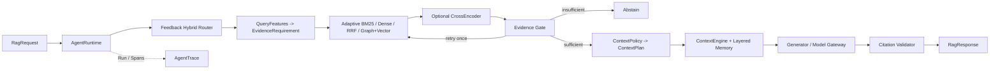

# EvalRAG

EvalRAG 是一个面向中文求职知识推理的图增强、自适应 RAG Agent Harness。系统统一处理岗位
JD、技术面经、项目资料、简历和用户画像，通过 Query 理解、混合/图检索、证据门控、分层
Context、结构化生成与引用校验回答问题；同时用 Run/Span Trace、版本化 Benchmark、Regression
和 CI Gate 说明一次回答为何产生、失败发生在哪一阶段、修改后是否真实改善。

## 快速入口

- [当前架构图：知识构建、在线回答、评测回归和服务链](docs/overview/architecture_diagram.md)
- [项目地图：模块、算法、设计原因与真实效果](docs/overview/project_map_zh.md)
- [三条运行链路：在线回答、离线评测和异步 Job](docs/overview/system_flows_explained_zh.md)
- [最终实验报告：dataset、配置、指标、失败和证据路径](docs/evaluation/final_experiment_report.md)

## 当前主链



Query Analyzer 先提取精确词面、语义、多来源和实体关系四类核心证据信号，再生成
`EvidenceRequirement` 并选择 Retriever；检索后只在策略允许且候选低置信时触发一次
CrossEncoder。Evidence Gate 决定生成、扩源一次或拒答；ContextPolicy 决定本轮需要哪些
Profile/History/Summary/Memory，ContextEngine 再在统一 token budget 下执行去重、裁剪和 Evidence
编排。Model Gateway 负责 timeout、瞬时错误有界重试、并发限制、熔断和 Provider fallback。

完整数据结构与失败分支见 [架构图](docs/overview/architecture_diagram.md)。

## 可复查结果

### Corpus 与 Benchmark

`evalrag_v0.3` 从固定 revision 的公开数据集/开源仓库和脱敏自有材料导入 669 份文档，经
SHA-256 与 SimHash 去重后保留 658 份、生成 4208 个自然 Chunk。五类 source 均有覆盖，
Manifest 保存 URL、revision、许可、采集时间、公开/脱敏和审核状态。

v0.3 Benchmark 共 240 条 Query（160 dev / 80 frozen test），覆盖单来源、跨来源、语义改写、
hard negative、不可回答、时效冲突和 2/3-hop 关系问题。标签是 corpus-grounded AI-assisted，
未冒充独立人工标注。统计与校验位于
[corpus_stats_v0.3.json](data/evaluation/corpus_stats_v0.3.json) 和
[evalrag_v0.3_validation.json](data/evaluation/evalrag_v0.3_validation.json)。

### Graph + Vector Frozen Retrieval

最终配置固定后在同一 `evalrag_v0.3/test`（80 Case，其中 60 条可答）上运行：

| Retriever | Recall@3 | Recall@5 | MRR | NDCG@5 | P95 |
|---|---:|---:|---:|---:|---:|
| BM25 | 39.17% | 46.67% | 35.19% | 36.49% | 15.50 ms |
| Graph + Vector | **49.17%** | **63.33%** | **57.58%** | **55.08%** | 1209.40 ms |

Graph + Vector 提高跨文档关系证据覆盖与前排排序，但 CPU P95 明显增加。图节点/边均回指原始
Chunk，LLM 引用的仍是文本证据而不是图结构。完整工件见
[P1 Frozen Release](reports/releases/p1-d7-v03-frozen-20260816/report.md)。

### Adaptive Retrieval 与 Reranker 的负结果

在统一 v0.3/dev 对照中，固定 Graph+Vector RRF 的 Recall@5/MRR 为 58.33%/52.10%，旧
Adaptive Graph 为 48.33%/42.21%。升级为 `QueryFeatures -> EvidenceRequirement -> Strategy`
后，Recall@5 为 48.75%，但 MRR 降至 39.01%；说明关系 Query 覆盖略增，策略误选和前排噪声
仍未解决，不能包装成质量提升。见
[Evidence-Need Adaptive Ablation](reports/ablations/p1-query-evidence-adaptive-v03-dev-20260825-fixed/report.md)。

CrossEncoder 支持 Never/Always/On-demand 三种策略。Always 在同集 dev 将 MRR 从 44.31%
提高到 49.22%，但 P95 从 1252 ms 增至 2799 ms；On-demand 调用率 18.12%，仍未取得质量与
延迟的 Pareto 最优。因此该能力保留为可配置策略和失败分析，不宣称默认配置获得稳定收益。

### Adaptive Context Engine

Context 链路为：

```text
SessionMemoryService
-> ContextSignalExtractor
-> ContextPolicy -> ContextPlan
-> ContextEngine -> ManagedContext
```

History 优先读取 Redis，miss/error 回源 PostgreSQL；Profile/Summary 保存于 PostgreSQL；长期
Memory 使用 pgvector 按用户范围语义召回。在 `evalrag_context_v0.1/dev` 的 60 组/300 turns
确定性测试中，Adaptive 与 Summary+Recent 均保持 100% Follow-up Success；Adaptive 将平均
Prompt Token 从 75.55 降至 60.68（-19.68%），History Redundancy 从 42.86% 降至 0。
该结果衡量 Context 选择，不等于自由生成答案准确率。见
[Adaptive Context Ablation](reports/ablations/p1-adaptive-context-v02-dev-20260823/report.md)。

### 端到端可靠性边界

早期 v0.2 真实 LLM frozen run 的 Citation Validity 与不可回答 Case 的 Abstention Accuracy
均为 100%，但 Claim-Level Grounding 有 3 条 `unknown`，因此不声称“零幻觉”。P1 v0.3 frozen
E2E 又暴露过度拒答：80 条中 8 条 answered、69 条 insufficient、3 条 error，可答案例的
End-to-End Success 仅 8.33%。这表明检索指标提升不等于最终答案质量提升，也定位出 Router、
Evidence Gate 与新关系型 Query 分布未同步标定的问题。详见
[最终实验报告](docs/evaluation/final_experiment_report.md)。

## 可观测与回归

AgentRuntime 为每次请求创建 root Run，各阶段作为 Span 记录：

```text
routing -> query_analysis -> retrieval -> rerank -> evidence
-> context -> generation -> validation
```

Trace 保存 config version、attempt、候选 rank/reason、used/skipped evidence、latency、token 和
error type。确认的失败进入 `open` regression；修复并跑完整 dev 后转为 `fixed`，由 executable
regression 和 CI Gate 防止旧问题复发。Trace Replay 使用保存的配置与输入重放控制流，不用重新
调用随机模型来挑更好的结果。

## 服务与持久化

FastAPI 提供 Query、Trace、Session 和 Evaluation Job 接口。PostgreSQL 保存请求、Run/Trace、
Profile 与任务状态；Redis 承担最近会话缓存和异步 Job 队列；独立 Worker 执行批量评测并把
`queued -> running -> succeeded/failed` 状态写回 PostgreSQL；pgvector 和 Neo4j 分别承载
持久化向量与图检索。Docker Compose 统一编排服务依赖和持久化卷。

```text
POST /v1/query -> AgentRuntime -> RagResponse + trace_id
POST /v1/evaluation-jobs -> PostgreSQL queued -> Redis -> Worker -> report + final status
```

同一 idempotency key 不会重复创建评测 Job。Worker 只对配置允许的瞬时故障做有上限重试；
鉴权、业务错误或重试耗尽会受控落为 `failed` 并保留 error type。

## 运行与验证

Python 3.10+：

```bash
python -m pip install -r requirements.txt
PYTHONPATH=src python -m unittest discover -s tests -p 'test_*.py'
```

测试验证代码契约与确定性行为，不代表回答准确率；真实 LLM、PostgreSQL/Redis/Neo4j 和模型权重
下载不进入默认离线单测。当前仓库在 2026-08-28 执行上述命令的结果为 227 tests run、
223 passed、4 skipped、0 failed。

Docker 可用时启动服务：

```bash
docker compose up --build
curl http://localhost:8000/health
```

提交 Query：

```bash
curl -X POST http://localhost:8000/v1/query \
  -H 'Content-Type: application/json' \
  -d '{"query":"哪个项目能证明我符合 RAG 岗位要求？","retriever":"graph_adaptive"}'
```

导出不访问网络的固定 Demo：

```bash
python scripts/export_fixed_demos.py
```

- [单来源回答](examples/fixed_demos/single_source.json)
- [多来源回答](examples/fixed_demos/multi_source.json)
- [证据不足拒答](examples/fixed_demos/abstention.json)

真实模型只从环境变量读取密钥，密钥不会进入代码、Trace 或报告：

```bash
export DEEPSEEK_API_KEY='your-key'
PYTHONPATH=src python scripts/run_rag_smoke.py
```

## CI

- [Service Integration](.github/workflows/p1-service.yml)：`main` push/手动触发，验证 API、Worker、
  PostgreSQL、Redis、Neo4j、异步 Job 和持久化恢复链路。
- [Evaluation Gate](.github/workflows/evaluation-gate.yml)：Pull Request/手动触发，运行确定性测试、
  regression 与 reference quality gate。
- [Persistent Retrieval Ablation](.github/workflows/p1-persistent-ablation.yml)：手动运行完整 v0.3/dev
  的文件精确扫描、pgvector exact/HNSW 和 Neo4j 对照，并上传版本化工件。

## 代码导航

| 模块 | 入口 | 作用 |
|---|---|---|
| Ingestion | `src/intern_rag/ingestion/chunking.py` | 统一 Document/Chunk、边界切分与 metadata 继承 |
| Router | `src/intern_rag/routing/factory.py` | Rule/Semantic/Hybrid/Feedback 路由 |
| Adaptive Retrieval | `src/intern_rag/retrieval/adaptive.py` | Query 特征、证据需求、策略选择和按需重排 |
| Graph Retrieval | `src/intern_rag/graph/`、`src/intern_rag/retrieval/graph.py` | 实体关系、有界多跳和 Graph+Vector 融合 |
| Context | `src/intern_rag/agent/context_policy.py`、`context_engine.py` | 分层记忆策略与统一预算编排 |
| Pipeline | `src/intern_rag/agent/pipeline.py` | Evidence Gate、有限重试、生成和引用校验 |
| Model Gateway | `src/intern_rag/agent/model_gateway.py` | timeout、退避、熔断、并发与 Provider fallback |
| Runtime / Trace | `src/intern_rag/runtime/agent_runtime.py`、`src/intern_rag/tracing/trace.py` | Run/Span、checkpoint 和 replay |
| Evaluation | `src/intern_rag/evaluation/` | predictions、metrics、semantic audit 和 regression |
| Serving / Worker | `src/intern_rag/serving/api.py`、`src/intern_rag/worker/evaluation_worker.py` | HTTP 契约与异步评测任务 |
| Persistence | `src/intern_rag/persistence/postgres.py`、`src/intern_rag/retrieval/pgvector.py`、`src/intern_rag/graph/neo4j.py` | 状态、记忆、向量与图持久化 |

## 数据与结论边界

- v0.3 是当前主版本；v0.2 只保留为 P0 历史基线，不能代表当前 Corpus 和 Query 设计。
- v0.3 标签是 corpus-grounded AI-assisted，不代表线上分布或独立人工标注。
- Recall@k/MRR/NDCG 衡量检索，不等于答案准确率；Citation Validity 只验证引用 ID 合法；
  Semantic Coverage 与 Claim-Level Grounding 依赖版本化 grader，也不是人工金标准。
- 当前自适应 selector、On-demand Reranker 和 v0.3 端到端链路仍有明确负结果；报告保留退化 Case，
  不以功能已实现替代效果提升。
- 项目不包含前端、Kubernetes、微服务拆分或在线自动学习 Router。

更多公开文档见 [文档导航](docs/README.md)。
