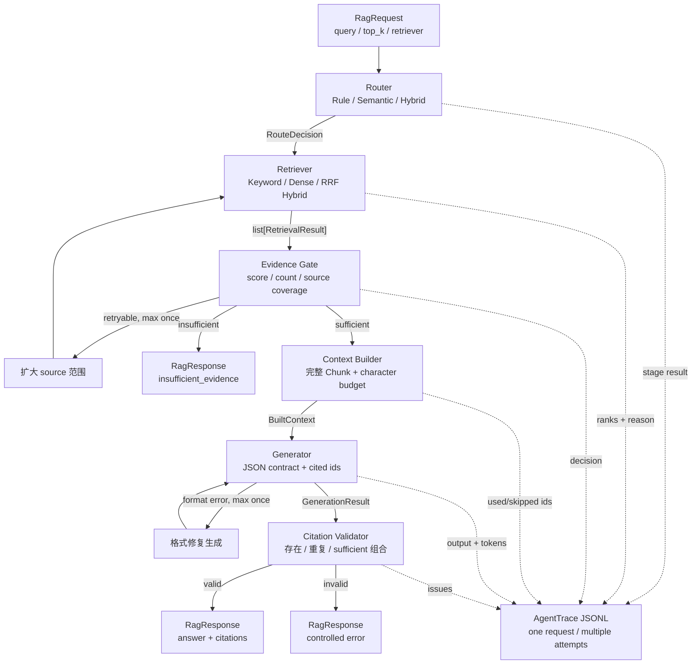
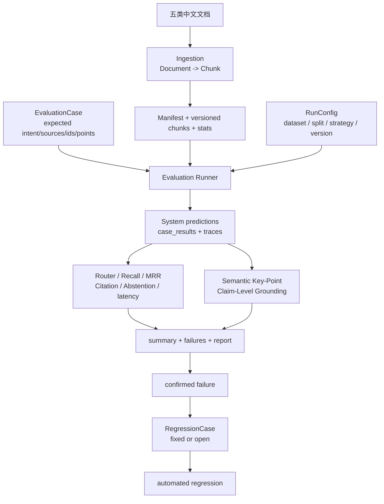

# EvalRAG 架构图

## 在线回答链路



主线传递的数据：

```text
RagRequest
-> RouteDecision
-> list[RetrievalResult]
-> EvidenceDecision
-> BuiltContext
-> GenerationResult
-> ValidationResult
-> RagResponse + AgentTrace
```

Evidence Gate 判断“当前是否值得调用模型”，Citation Validator 判断“模型返回的引用
结构是否合法”，Claim-Level Grounding 则在离线评测中判断“事实是否真的被引用证据
支持”。三者解决的问题不同。

## 离线评测链路



## 关键配置取舍

| 决策 | 当前选择 | 原因 |
|---|---|---|
| Router | Rule + Semantic Hybrid | dev Accuracy 最高，但记录 CPU 延迟代价 |
| Retriever | RRF Hybrid | frozen Recall@3/MRR 优于 Keyword 与 Dense 单路 |
| Reranker | 关闭 | dev Recall、MRR 和 P95 同时退化 |
| Evidence | 最多一次 source 扩展 | 避免弱证据直接生成和无限重试 |
| Generation | JSON contract，temperature=0 | 便于解析、引用校验和复现 |
| Grounding | claim-level，unknown 不算 supported | Judge 失败不能伪装成答案可靠 |

对应数字和工件见 [最终实验报告](final_experiment_report.md)。
