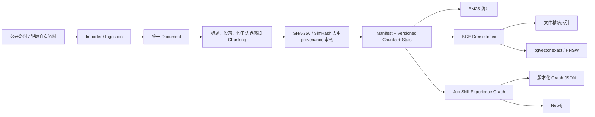
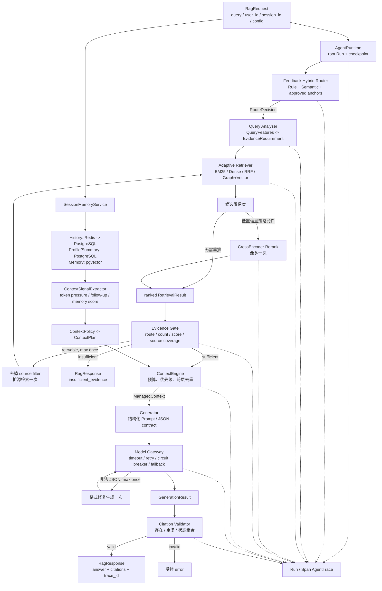
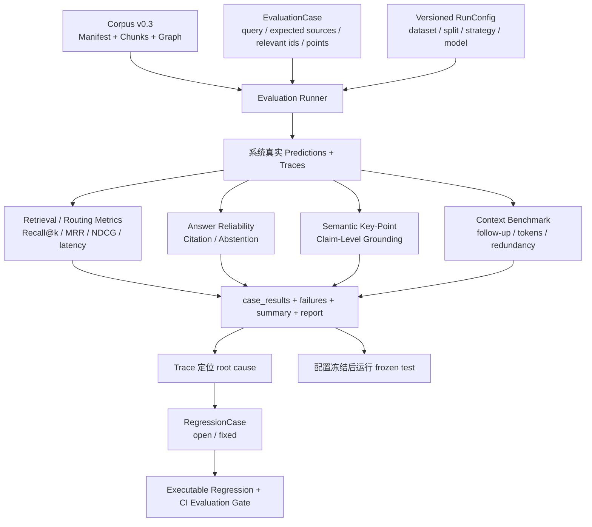
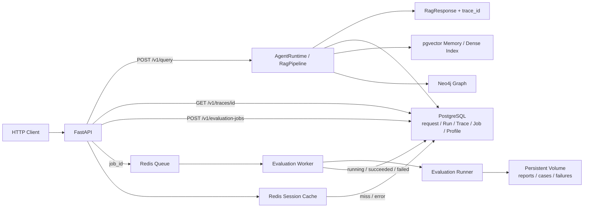

# EvalRAG 架构图

本文只展示当前 P1 架构和关键边界。模块职责、算法取舍与实测结果见
[项目地图](project_map_zh.md) 和 [最终实验报告](../evaluation/final_experiment_report.md)。

## 1. 离线知识构建



- `Manifest` 记录每份材料的来源、revision、许可、采集时间、公开/脱敏和审核状态。
- `Versioned Chunks` 固定索引与评测共同消费的证据快照，避免数据变化后实验无法复现。
- `Stats` 记录数量、长度分布、空文档、重复 hash、模板行和来源占比等质量信息。

## 2. 在线回答链路



主链数据结构：

```text
RagRequest
-> RouteDecision
-> QueryFeatures -> EvidenceRequirement
-> list[RetrievalResult] + RetrievalDecision
-> EvidenceDecision
-> ContextPlan -> ManagedContext
-> GenerationResult
-> ValidationResult
-> RagResponse + AgentTrace(Run/Spans)
```

Evidence Gate 判断“当前证据是否值得调用模型”；Citation Validator 判断“模型返回的引用
结构是否合法”；Claim-Level Grounding 在离线评测中判断“回答中的事实是否被引用证据支持”。

## 3. 离线评测、失败与回归



- `dev` 用于比较策略和修复失败；`frozen test` 只在配置固定后运行，不用于继续调参。
- `failure` 是系统输出未满足标签或可靠性协议的 Case，不只是脚本异常。
- `open regression` 跟踪尚未修复的问题；`fixed regression` 在 CI 中防止旧问题复发。

## 4. 服务、任务与持久化



PostgreSQL 是任务状态和运行元数据的真相来源；Redis 只承担短期队列与最近会话缓存；
pgvector/Neo4j 保存持久化检索结构；完整报告和逐 Case 工件保存在文件卷。Docker Compose
编排 API、Worker、PostgreSQL、Redis 和 Neo4j，GitHub Actions 执行服务链与持久化验证。

## 5. 当前配置取舍

| 决策点 | 当前实现与证据边界 |
|---|---|
| Router | Rule/Semantic/Hybrid/Feedback 均可配置；反馈版在 v0.2 dev 提升，但在 v0.3 Source Exact 未超过 Rule，不能宣称跨分布稳定提升。 |
| Query Analyzer | 使用四个核心证据信号生成 `EvidenceRequirement`，再映射 Retriever；当前是可解释规则版，不是学习得到的 Policy。 |
| Retrieval | Graph+Vector 在 v0.3 frozen 相比 BM25 提升 Recall@5/MRR，但 CPU P95 明显增加；Adaptive selector 在 dev 的覆盖略升、MRR 下降。 |
| Reranker | 支持 Never/Always/On-demand CrossEncoder；Always 改善部分 MRR 但延迟高，On-demand 尚未取得质量/延迟 Pareto 最优。 |
| Evidence | 只允许一次扩源重试，区分弱证据、正常不可回答和模型格式错误，避免无限循环。 |
| Context | `ContextPolicy -> ContextPlan -> ContextEngine` 动态选择分层记忆并执行统一预算；当前 60 组/300 turns 结果属于确定性 Context benchmark。 |
| Generation | JSON contract、temperature=0；Model Gateway 提供有界重试、熔断和 Provider fallback，鉴权错误不盲重试。 |
| Grounding | claim-level verdict 为 supported/unsupported/unknown；Judge unavailable 不记为 supported。 |

所有数字及其 dataset、split、配置和限制统一以
[最终实验报告](../evaluation/final_experiment_report.md) 为准。
