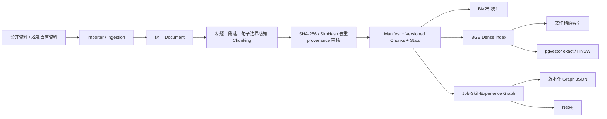
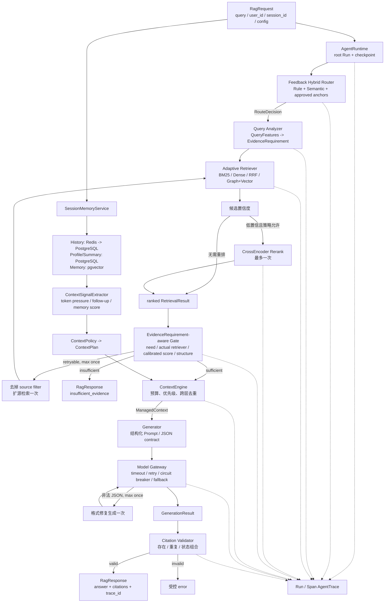
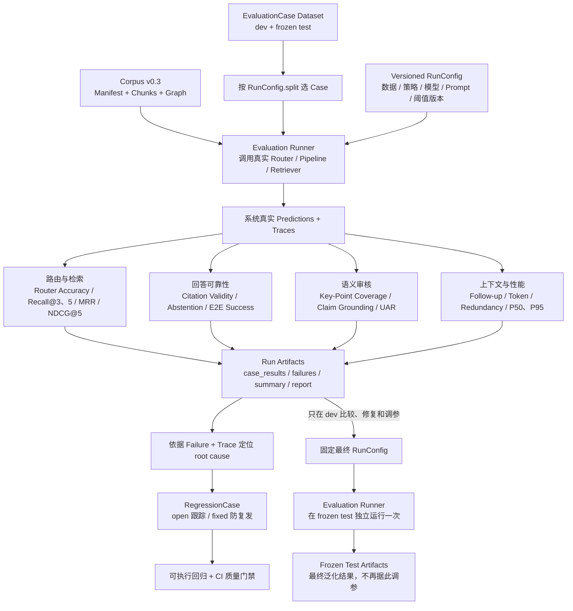
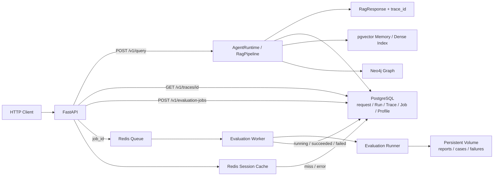

# EvalRAG 架构图

本文只展示当前 P1 架构和关键边界。模块职责、算法取舍与实测结果见
[项目地图](project_map_zh.md) 和 [最终实验报告](../evaluation/final_experiment_report.md)。

## 1. 离线知识构建



- `Manifest` 记录每份材料的来源、revision、许可、采集时间、公开/脱敏和审核状态。
- `Versioned Chunks` 固定索引与评测共同消费的证据快照，避免数据变化后实验无法复现。
- `Stats` 记录数量、长度分布、空文档、重复 hash、模板行和来源占比等质量信息。

## 2. 在线回答链路



主链数据结构：

```text
RagRequest
-> RouteDecision
-> QueryFeatures -> EvidenceRequirement
-> list[RetrievalResult] + RetrievalDecision
-> EvidenceDecision
-> ContextPlan -> ManagedContext
-> GenerationResult
-> ValidationResult
-> RagResponse + AgentTrace(Run/Spans)
```

Evidence Gate 判断“当前证据是否值得调用模型”；Citation Validator 判断“模型返回的引用
结构是否合法”；Claim-Level Grounding 在离线评测中判断“回答中的事实是否被引用证据支持”。

## 3. 离线评测、失败与回归



### 3.1 先把这条链路讲清楚

1. **案例集确实是 dev 与 frozen test 的总和。** 每条 `EvaluationCase` 包含 Query、
   `answerable`、期望 intent/source、相关 Chunk ID 和回答要点等人工/模型辅助审核标签；
   Runner 每次只按 `RunConfig.split` 选择其中一个子集。
2. **Versioned RunConfig 不是泛指项目版本。** 它是一次实验的配置快照，至少固定数据集
   版本、split、Router/Retriever、top-k、模型与 revision、Prompt、Evidence 阈值和随机性
   参数。代码 commit 可以一起记录，但不能代替实验配置。
3. **Evaluation Runner 是离线 Harness 的入口。** 检索实验只调用真实 Router/Retriever；
   端到端实验调用与在线回答相同的 Pipeline 模块。它不会必须经过 FastAPI，但必须使用真实
   系统实现产生 prediction，不能手写 predicted 字段。
4. **Prediction 是系统对该 Query 的实际输出。** 它包括预测路由、排序后的 Chunk、回答状态、
   Answer、Citation 等；再与 Case 标签对照计算指标。Trace 保存的是同一次执行的逐阶段中间
   状态、attempt、耗时、Token 和失败原因。
5. **Frozen test 是第二次独立评测，但不是重复测同一批题。** dev 可以反复运行，用来选策略、
   调阈值和修 bug；最终配置固定后，再把 Runner 的 split 改为 test 运行一次。v0.3 test 已有
   历史 Run，因此 2026-09-03 的结果称为“锁定配置 release test”，不冒充从未查看的盲测集；
   看到结果后仍不能继续调参并复用同一版本声称最终结果。

### 3.2 指标总表

并非每一种 Run 都计算下表全部指标：Retrieval Run 只计算路由/检索/延迟，端到端 Run 增加
回答可靠性，Semantic Audit 使用已保存 Prediction 计算语义指标，Context Benchmark 计算多轮
上下文指标。

| 维度 | 指标（中文） | 含义与设计原因 | 计算方式 | 计算阶段 |
|---|---|---|---|---|
| 路由 | Router Accuracy（路由准确率） | 判断系统是否把问题送到正确意图和知识源；路由错会让后续检索范围一开始就错 | `intent` 相同且预测 source 集合与标签完全相同的 Case 数 / 有路由标签的 Case 数 | Router 输出后 |
| 检索 | Recall@3 / Recall@5（前 k 召回率） | 判断前 k 条候选覆盖了多少标注证据，衡量“有没有找回来” | 单 Case：`|top-k IDs ∩ relevant IDs| / |relevant IDs|`，再对可回答 Case 取宏平均 | Retriever 后 |
| 检索 | MRR（平均倒数排名） | Recall 只看命中，MRR 进一步判断第一条相关证据是否靠前 | 每 Case 第一条 relevant Chunk 排名的倒数；未命中记 0，再取平均 | Retriever 后 |
| 检索 | NDCG@5（归一化折损累计增益） | 衡量前 5 条结果整体排序质量，使靠前命中贡献更大 | 计算 top-5 的 DCG，再除以理想排序 IDCG | Retriever 后 |
| 图检索 | Path Validity / Selector Accuracy（路径有效率 / 策略选择准确率） | 检查图路径是否真实存在，以及自适应策略是否在关系题上选对 Graph | 有效路径数 / 返回路径数；策略与 Case 的期望证据需求一致数 / 有标签 Case 数 | Graph/Adaptive Retriever 后 |
| 引用 | Citation Validity（引用合法率） | 防止模型引用不存在或本轮 Context 外的 Chunk；只检查结构合法，不代表内容支持回答 | 当前 Context 中存在的 Citation ID 数 / 模型返回 Citation 数；已回答但无引用记 0 | Citation Validator / Evaluation |
| 拒答 | Abstention Accuracy（拒答准确率） | 衡量人工标为不可回答的 Case 是否被正确拒答，防止无证据硬答 | 正确返回 `insufficient_evidence` 的不可回答 Case 数 / 全部不可回答 Case 数 | Pipeline 最终状态后 |
| 拒答 | Unexpected Abstention / Should Abstain（意外拒答 / 应拒未拒） | 单看拒答准确率会掩盖“所有问题都拒答”；两类错误分别观察过度保守和无依据回答 | 可回答但拒答的 Case 数；不可回答但系统回答的 Case 数 | Pipeline 最终状态后 |
| 回答 | Key-Point Coverage（关键要点覆盖率） | 判断回答是否覆盖标签中的核心信息；语义版避免同义改写被字符串匹配误判 | `covered expected points / all expected points`；存在 `unknown` 时报告 unavailable | Answer Semantic Audit |
| 事实支持 | Claim-Level Grounding（断言级证据支持度） | 将回答拆为最小事实断言，逐条检查是否被引用证据支持，区别于 Citation ID 合法 | 每条 Claim 输出 `supported / unsupported / unknown`、Citation 和 evidence span | Grounding Audit |
| 事实支持 | UAR（Unsupported Answer Rate，无依据回答率） | 衡量整条回答是否含至少一个没有证据支持的事实主张 | 含 unsupported Claim 的已回答 Case 数 / Grounding 结论已知的已回答 Case 数 | Grounding Audit 汇总 |
| 端到端 | End-to-End Success Rate（端到端成功率） | 防止用某个局部高指标冒充系统整体正确 | 可答题需回答、路由/召回/引用/要点/事实支持均达标；不可答题需正确拒答，再以成功 Case / 全部 Case | Evaluation 汇总 |
| 上下文 | Follow-up Success（追问成功率） | 判断裁剪 History/Memory 后是否仍保留回答追问所需信息 | 满足该多轮 Case 预期证据或答案条件的 Follow-up 数 / 全部 Follow-up 数 | Context Benchmark |
| 上下文 | Prompt Token / History Redundancy（提示词 Token / 历史冗余率） | 衡量上下文质量相同情况下的成本，以及重复历史是否被去重 | 每轮 Prompt Token 的均值/P95；重复历史项或 Token 占全部历史的比例 | Context Engine 后 |
| 性能 | P50 / P95 Latency（中位 / 尾延迟） | P50 代表典型请求，P95 暴露少数慢请求，防止只看平均值掩盖长尾 | 对 Router、Retrieval、Context、Generation、Validation、Total 分阶段取第 50/95 百分位 | Trace / Run 汇总 |
| 成本 | Tokens / Estimated Cost（Token 与估算成本） | 比较模型/Prompt 策略的资源代价 | 汇总输入输出 Token，并按固定 Provider 价格快照估算；不可把估算值称为账单 | Model Gateway / Run 汇总 |

### 3.3 `case_results`、`failures`、`summary` 与 `report`

| 工件 | 包含什么 | 用途 |
|---|---|---|
| `predictions` / `case_results.jsonl` | 每个 Case 的标签、系统预测、逐项指标、状态和延迟；Prediction 是原始输出，Case Result 是“输出 + 标签对照后的结果” | 逐题复查与重新计算指标 |
| `traces.jsonl` | 每次请求的 Route、候选 Chunk、Evidence Decision、Context、Generation、Validation、attempt、latency/token | 定位失败发生在哪一阶段 |
| `failures.jsonl` | 从 Case Result 中筛出的所有未满足评测协议的记录；不是只记录程序崩溃 | 失败分析、修复排期和 Regression 来源 |
| `summary.json` | Case 数、总体/分类指标、P50/P95、失败类型计数、版本与限制 | 程序可读的 Run 总结和 Run 间比较 |
| `report.md` | 把 Config、Summary、差异 Case、失败分析和结论组织成人能阅读的报告 | 实验复盘与证据展示 |

`failure` 有两大类：**质量失败**是系统正常执行但没有满足标签/协议；**执行失败**是 Retriever、
LLM、Grader、存储或超时等异常。当前主要可执行类型如下：

| 环节 | 常见 failure type | 何时产生 / 对应判断 |
|---|---|---|
| Router | `router_wrong` | intent 或 routed sources 与 Case 标签不一致，Router Accuracy 失败 |
| Retrieval | `retrieval_incomplete` / `retrieval_miss` | Recall@5 小于 1 表示标注证据未完全召回；等于 0 表示完全漏召回 |
| Graph/Adaptive | `graph_strategy_wrong` / `graph_path_invalid` / `graph_retrieval_incomplete` | 关系题策略选择错误、返回路径不存在，或 Graph 相关证据未完整召回 |
| Evidence/Pipeline | `unexpected_abstention` | Case 可回答，但 Evidence Gate/后续流程最终拒答 |
| Evidence/Pipeline | `should_abstain_but_answered` | Case 不可回答，但系统最终给出答案 |
| Citation | `citation_invalid` | 已回答但引用不存在、在 Context 外、为空或组合不合法 |
| Answer | `key_point_incomplete` | 回答未达到配置要求的 Key-Point Coverage |
| Grounding | unsupported / unknown verdict | 回答含无证据支持的 Claim，或 Grader 无法可靠判断；unknown 不能冒充 supported |
| 执行阶段 | `retriever_error`、LLM format/timeout、grader unavailable 等 | 模块抛错、超时或输出契约非法；Case 仍保留并记录 error type |

### 3.4 从 Failure 到 Regression 和 CI Gate

`Trace 定位 root cause` 主要针对 Failure：先看失败指标确定环节，再沿同一 Case 的 Trace 检查
Route、候选、门控、Context、模型输出和校验结果。**根因结论通常需要开发者确认**，AI/脚本可以
聚类和给候选原因，但不能只凭一个低分自动断言根因。

确认后的失败转成 `RegressionCase`：`open` 表示问题尚未修复，只跟踪不计通过率；`fixed` 表示
已经修好并带可执行断言，以后每次迭代都重新运行，确保旧问题没有复发。它与在线 Pipeline 的
“扩源 retry / 格式 retry”无关：retry 发生在一次用户请求内部，Regression 发生在开发与测试阶段。

`CI Evaluation Gate` 建议中文称为 **CI 质量门禁（持续集成评测门禁）**。代码提交后，CI 自动运行
fixed Regression，并把候选版本与同数据版本的 reference 指标比较：质量下降超过允许值、P95
增长超阈值、指标缺失或 fixed Regression 未 100% 通过时，门禁失败并阻止该版本被当作可发布版本。

## 4. 服务、任务与持久化



PostgreSQL 是任务状态和运行元数据的真相来源；Redis 只承担短期队列与最近会话缓存；
pgvector/Neo4j 保存持久化检索结构；完整报告和逐 Case 工件保存在文件卷。Docker Compose
编排 API、Worker、PostgreSQL、Redis 和 Neo4j，GitHub Actions 执行服务链与持久化验证。

## 5. 当前配置取舍

| 决策点 | 当前实现与证据边界 |
|---|---|
| Router | Rule/Semantic/Hybrid/Feedback 均可配置；反馈版在 v0.2 dev 提升，但在 v0.3 Source Exact 未超过 Rule，不能宣称跨分布稳定提升。 |
| Query Analyzer | v2 使用少量强词面/语义/多源/关系信号生成 `EvidenceRequirement`；任意英文 token 不再自动等于 exact，规则和策略映射均版本化。 |
| Retrieval | release test 中 Graph+Vector 相比 BM25 将 Recall@5/MRR 从 46.67%/35.19% 提升到 69.17%/62.92%；Adaptive v2 Recall@5 同为 69.17%，MRR 为 53.11%。 |
| Evidence Gate | 根据 need 和实际底层 Retriever 选择独立校准；分数不可分时关闭 score gate，改查数量、来源覆盖和 Graph path，并保留一次扩源。 |
| CI Gate v2 | Recall@5/MRR 和 fixed regression 阻塞发布，NDCG/策略分布/Graph 调用率只报告；质量容差为 `1 / answerable_case_count`，P95 1.25 倍仅是 dev 工程预算。 |
| Reranker | 支持 Never/Always/On-demand CrossEncoder；Always 改善部分 MRR 但延迟高，On-demand 尚未取得质量/延迟 Pareto 最优。 |
| Evidence | 只允许一次扩源重试，区分弱证据、正常不可回答和模型格式错误，避免无限循环。 |
| Context | `ContextPolicy -> ContextPlan -> ContextEngine` 动态选择分层记忆并执行统一预算；当前 60 组/300 turns 结果属于确定性 Context benchmark。 |
| Generation | JSON contract、temperature=0；Model Gateway 提供有界重试、熔断和 Provider fallback，鉴权错误不盲重试。 |
| Grounding | claim-level verdict 为 supported/unsupported/unknown；Judge unavailable 不记为 supported。 |

所有数字及其 dataset、split、配置和限制统一以
[最终实验报告](../evaluation/final_experiment_report.md) 为准。
